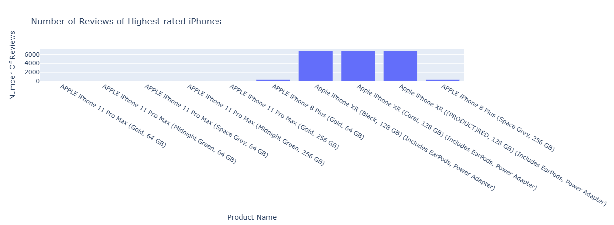
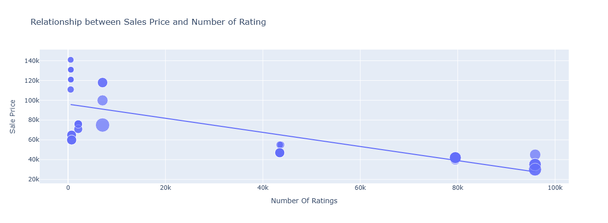
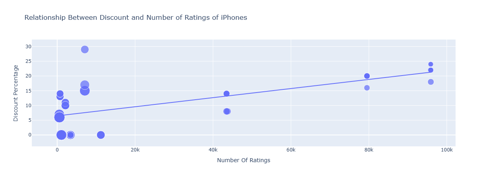

# 📘 **iPhone Sales Analysis – Finding the Best Value iPhones from Real Customer Data**

A data-driven exploration of iPhone prices, ratings, reviews, and discounts to help buyers avoid overpaying and identify the best value Apple devices.

---

# 📌 **The Problem (Situation)**

Apple releases multiple iPhone models each year, all priced differently and with varying ratings, reviews, and discounts.
Consumers often struggle to answer basic questions:

* *Does a higher price mean better satisfaction?*
* *Is the “best-rated” iPhone actually worth its price?*
* *Which models offer the best value for money?*

This often leads to **overpaying** or choosing a model that doesn’t offer the best overall value.

---

# 💡 **The Approach (Task & Action)**

### 🎯 **Goal**

Analyze Apple product data to discover:

* Which iPhones provide **best value** (rating vs price)
* How **price**, **ratings**, **reviews**, and **discounts** relate
* Which models buyers can trust (high-rated *and* high-reviewed)

### 🛠️ **What Was Done**

* Loaded and cleaned Apple iPhone product data
* Verified data completeness (no missing values)
* Analyzed distributions of:

  * Star Ratings
  * Number of Ratings & Reviews
  * Sale Price & Discount %
* Identified:

  * Highest-rated devices
  * Most-reviewed and trustworthy models
  * Price–rating and discount–rating relationships
* Built visualizations with **Plotly** for intuitive insights
* Summarized findings in a story-driven, business-friendly format

---

# 📊 **Key Results (Business Value)**

* ⭐ **iPhones consistently maintain high satisfaction**, averaging ~4.6★ across models.
* 💰 **Cheaper iPhones sell more and receive more ratings**, proving stronger trust and adoption.
* 🚫 **Expensive ≠ better:** Premium models *do not* provide significantly better ratings than mid-range ones.
* 🎯 **iPhone SE variants stand out as best value**, offering strong ratings at ~¼ the price of flagship models.
* 🔍 **Higher reviews → higher trust:** The most-reviewed models give buyers confidence due to real-world usage proof.

---

# 📸 **Visual Insights**

### **Top iPhones by Number of Ratings**


---

### **Reviews of Highest-Rated iPhones**



---

### **Price vs Number of Ratings**

*Cheaper iPhones are purchased and rated more often in India.*


---

### **Discount vs Number of Ratings**



---

# 🔍 **Findings**

* ✔ **No missing values** — dataset is clean and reliable.
* ⭐ Highest-rated iPhones all sit in the **4.5–4.7★ range**, showing uniform satisfaction across the brand.
* 🧑‍🤝‍🧑 iPhones with **many reviews** are the most trustworthy for buyers.
* 📉 **Negative linear relationship** between sale price and number of ratings**

  > Lower-priced iPhones sell more and receive more ratings in India.
* 🎯 **Value-for-Money Models Identified:**

  * iPhone SE variants provide premium experience at a lower price.
* 💸 **Most Expensive iPhone:** Apple iPhone 12 Pro (512 GB) ~₹1,40,900
* 💸 **Least Expensive iPhone:** Apple iPhone SE (64 GB) ~₹29,999
* ❗ A 4–5x price jump does **not** equate to higher user satisfaction.

---

# 🛠️ **Tech Stack**

* **Python**
* **Pandas**, **NumPy** – data analysis
* **Plotly Express** – interactive visualizations
* **Jupyter Notebook** – exploratory environment
* **CSV Dataset** – scraped from Flipkart

---

# 🚀 **How to Run This Project**

### **1️⃣ Clone the repository**

```bash
git clone https://github.com/your-username/iphone-sales-analysis.git
cd iphone-sales-analysis
```

### **2️⃣ Install dependencies**

```bash
pip install -r requirements.txt
```

### **3️⃣ Open the notebook**

```bash
jupyter notebook IPhone-Sales-Analysis.ipynb
```

### **4️⃣ Run analysis**

Click: **Kernel → Restart & Run All**

---

# 🧠 **Technical Breakdown (Line-by-Line Code Explanation)**

## **1. Imports**

```python
import numpy as np
import pandas as pd
import plotly.express as px
```

* `pandas`: Load and manipulate dataset
* `numpy`: Numerical utilities
* `plotly.express`: Create visualizations

---

## **2. Load the Dataset**

```python
data = pd.read_csv("apple_products.csv")
data.head()
```

* Loads Apple product inventory
* Displays first rows for structure validation

---

## **3. Missing Value Check**

```python
data.isnull().sum()
```

* Confirms no missing values
* Ensures reliable downstream analysis

---

## **4. Data Summary**

```python
data.describe()
```

* Provides statistical insights about prices, reviews, ratings
* Helps detect outliers

---

## **5. Highest Rated iPhones**

```python
highest_rated = data.sort_values(by=['Star Rating'], ascending=False).head(10)
```

* Sorts products by rating
* Extracts top 10 highly-rated models

---

## **6. Plot: Number of Ratings**

```python
iphones = highest_rated['Product Name'].value_counts()
label = iphones.index
counts = highest_rated['Number Of Ratings']
figure = px.bar(highest_rated, x=label, y=counts)
figure.show()
```

* Prepares x-axis labels (phone names)
* Uses rating counts for popularity measurement
* Visualizes which models are widely bought

---

## **7. Plot: Number of Reviews**

```python
counts = highest_rated['Number Of Reviews']
figure = px.bar(
    highest_rated, x=label, y=counts,
    title='Number of Reviews of Highest rated iPhones'
)
figure.show()
```

* Similar to rating count chart
* Reviews add extra trust beyond ratings

---

## **8. Scatter: Sale Price vs Ratings Count**

```python
figure = px.scatter(
    data_frame=data,
    x="Number Of Ratings",
    y="Sale Price",
    size="Discount Percentage",
    trendline="ols",
    title="Relationship between Sales Price and Number of Rating"
)
figure.show()
```

### **Insight:**

* Lower-priced phones get more ratings → **more buyers**
* Bubble size = discount %
* Trendline shows negative correlation

---

## **9. Scatter: Discount vs Ratings Count**

```python
figure = px.scatter(
    data_frame=data,
    x="Number Of Ratings",
    y="Discount Percentage",
    size="Sale Price",
    trendline="ols",
    title="Relationship Between Discount and Number of Ratings of iPhones"
)
figure.show()
```

### **Insight:**

* Discounts help attract more buyers, especially for high-priced models.
* Larger bubbles represent more expensive phones.
* Shows whether discounting impacts consumer engagement.

---

## **10. Most & Least Expensive iPhones**

```python
most_expensive = data.loc[data['Sale Price'].idxmax()]
least_expensive = data.loc[data['Sale Price'].idxmin()]

print(f"Most Expensive Product: {most_expensive}")
print("
")
print(f"Least Expensive product: {least_expensive}")
```

### **Insight:**

* `idxmax()` returns the row with the highest sale price.
* `idxmin()` returns the row with the lowest sale price.
* Helps contrast affordability vs performance.

---

# 🎯 **Conclusion**

This project demonstrates:

* Clean data analysis using Python
* Strong visual storytelling with Plotly
* Ability to translate raw data into **business-impact insights**
* Professional documentation suitable for recruiters, hiring managers, and data peers

By analyzing pricing, ratings, discounts, and reviews, we identify which iPhones truly offer the **best value for money** — empowering smarter buying and retail decisions.

