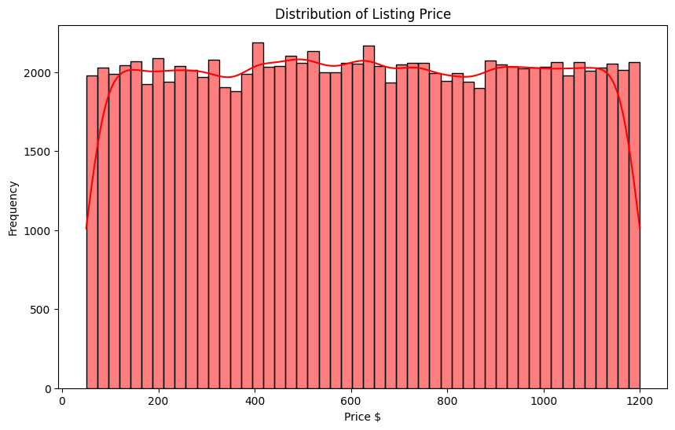
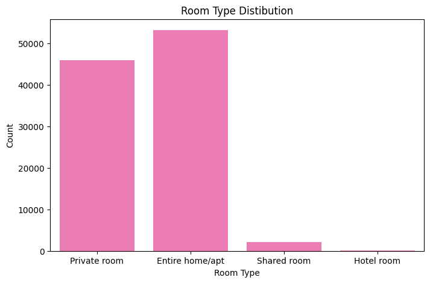
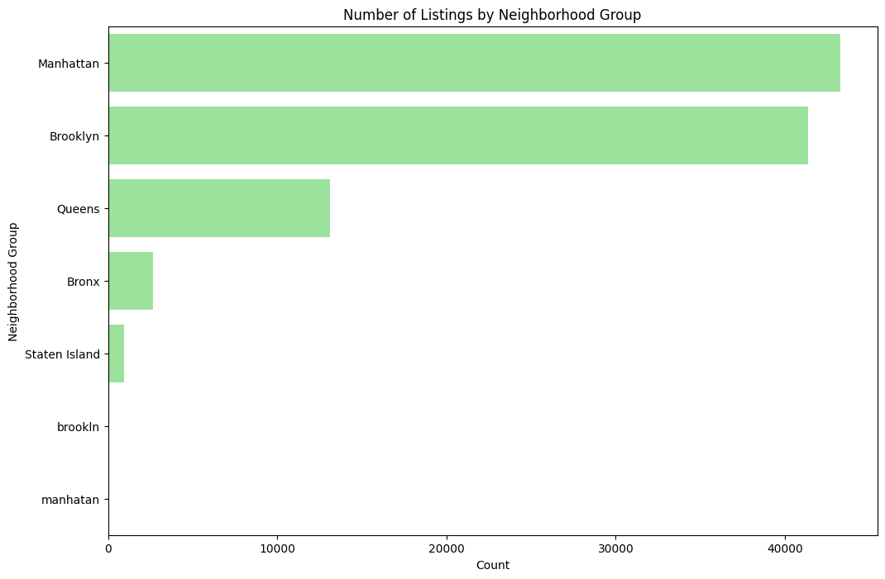
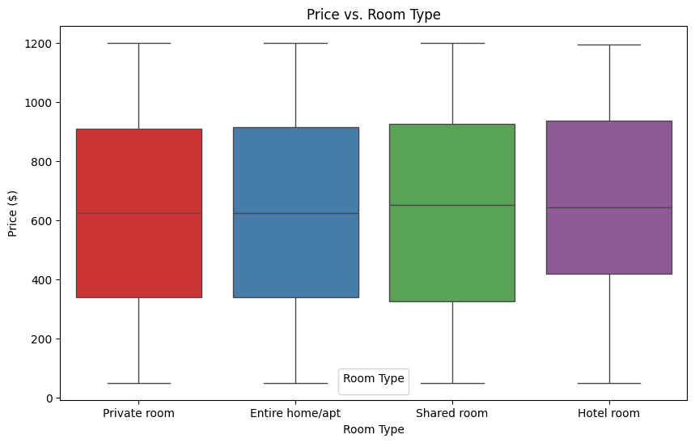
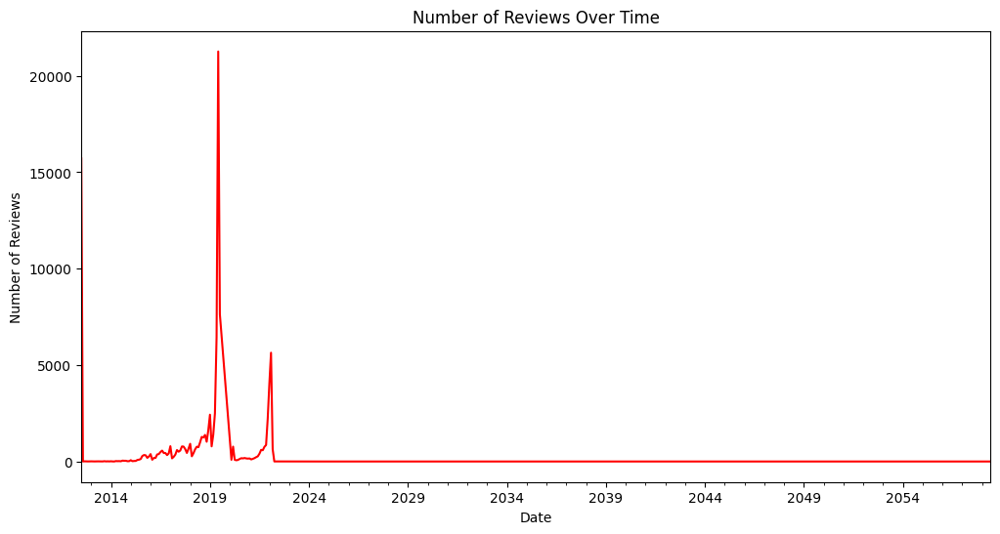

# 🏡 **Airbnb NYC Listing Analysis – Understanding Pricing, Demand, and Neighborhood Trends**

A data-driven exploration of Airbnb listings across New York City to understand how **price**, **room type**, **neighborhood**, and **guest reviews** influence traveler decisions and market behavior.

---

# 📌 **The Problem (Situation)**

New York City has thousands of Airbnb listings with wide variations in **price**, **room type**, **location**, and **popularity**. Guests often struggle with:

* *What is a reasonable nightly price in NYC?*
* *Which room types are most common or affordable?*
* *Which neighborhoods have the most listings?*
* *How has Airbnb demand changed over time?*

With no structured analysis, both **guests** and **hosts** find it hard to benchmark prices, understand demand, and identify the best neighborhoods.

---

# 💡 **The Solution (Task & Action)**

### 🎯 **Goal**

Analyze NYC Airbnb listing data to uncover:

* Typical **price ranges** and affordability trends
* Distribution of **room types**
* Most popular **neighborhood groups**
* How **price varies by room type**
* How **guest engagement (reviews)** has changed over time

### 🛠️ **Actions Taken**

Using Python and standard data science tools, we:

* Loaded ~100K Airbnb listings from `airbnbdata.csv`
* Cleaned and prepared the dataset:

  * Converted `last review` to datetime
  * Filled missing values (e.g., `reviews per month` with 0)
  * Removed low-value columns (`license`, `house_rules`)
  * Removed duplicate entries
  * Cleaned `price` and `service fee` columns (removed `$`, converted to numeric)
* Explored price statistics (min, max, median, percentiles)
* Created visualizations for price, room type, neighborhoods, price differences, and review trends

---

# 📊 **Key Results (Business-Friendly Insights)**

* 💵 **NYC Airbnb stays are expensive**, with a median price around **$625/night**.
* 🎯 **Typical listings fall between $340 and $910/night**, representing the 25th–75th percentile.
* 🏠 **Entire homes (52%) and private rooms (45%) dominate the platform**—shared rooms and hotel rooms make up <3%.
* 🌇 **Brooklyn and Manhattan together host ~84% of all listings**, making them the core Airbnb hubs.
* 📉 **Price strongly depends on room type**—entire homes are significantly more expensive than private rooms.
* 📈 **Review activity grew until 2019**, dipped during 2020 (pandemic), and began recovering afterward.

---

# 📸 **Visual Insights**

### **Distribution of Listing Price**



---

### **Room Type Distribution**



---

### **Number of Listings by Neighborhood Group**



---

### **Price vs Room Type**



---

### **Number of Reviews Over Time**



---

# 🔍 **Detailed Findings**

* The dataset has a large volume of listings (~100K), providing strong statistical insights.
* **No critical missing values** after cleaning — handled via filling or removal.
* **Price distribution is heavily right-skewed**, with luxury listings pushing the max upward.
* **Entire homes and private rooms** are by far the most common choices for guests.
* **Manhattan and Brooklyn dominate supply**, likely tied to tourism, business travel, and population density.
* **Price differences across room types** are significant and intuitive:

  * Entire homes cost the most
  * Private rooms are affordable alternatives
  * Shared rooms rarely appear and target niche travelers
* **Review volume trends** reflect macro events (e.g., COVID impact in 2020).

---

# 🛠️ **Tech Stack**

* **Python**
* **Pandas**, **NumPy** — data manipulation and cleaning
* **Matplotlib**, **Seaborn** — visualizations
* **Jupyter Notebook** — exploratory data analysis
* **CSV dataset** — Airbnb NYC listing data

---

# 🚀 **How to Run This Project**

### **1. Clone the repository**

```bash
git clone https://github.com/your-username/airbnb-nyc-analysis.git
cd airbnb-nyc-analysis
```

### **2. Install dependencies**

```bash
pip install -r requirements.txt
```

### **3. Open the notebook**

```bash
jupyter notebook AirBnB-Data-Analysis.ipynb
```

### **4. Run the analysis**

Use **Kernel → Restart & Run All** to reproduce results.

---


# 🧠 **Technical Breakdown (Line-by-Line Code Explanation)**

This section explains each major step from the notebook.

## **1. Imports**

```python
import numpy as np
import pandas as pd
import matplotlib.pyplot as plt
import seaborn as sns
```

* Loads core libraries for data cleaning and visualization.

---

## **2. Load the Dataset**

```python
df = pd.read_csv("airbnbdata.csv")
df.head()
```

* Reads Airbnb NYC dataset into a DataFrame.
* `head()` previews columns like: name, price, room type, neighborhood, reviews, etc.

---

## **3. Initial Check for Missing Values**

```python
df.isnull().sum()
```

* Identifies missing fields that need to be cleaned.

---

## **4. Convert `last review` to datetime**

```python
df['last review'] = pd.to_datetime(df['last review'], errors='coerce')
```

* Converts strings to datetime format.
* Invalid entries become `NaT`.

---

## **5. Handling Missing Values**

```python
df['reviews per month'] = df['reviews per month'].fillna(0)
df['last review'] = df['last review'].fillna(df['last review'].min())
```

* Missing review rates replaced with 0.
* Missing dates replaced with earliest valid date.

---

## **6. Dropping Low-Value Columns**

```python
df = df.drop(['license', 'house_rules'], axis=1)
```

* These fields are sparse and add no analytical value.

---

## **7. Removing Duplicates**

```python
df = df.drop_duplicates()
```

* Ensures counts and visualizations are accurate.

---

## **8. Cleaning Price Columns**

```python
df['price'] = df['price'].str.replace('$', '').astype(float)
df['service fee'] = df['service fee'].str.replace('$', '').astype(float)
```

* Converts price fields from strings to numeric.
* Required for plotting and statistical analysis.

---

## **9. Price Distribution Plot**

```python
plt.figure(figsize=(10,6))
sns.histplot(df['price'], kde=True)
plt.title('Distribution of Listing Price')
plt.show()
```

* Shows how prices vary across NYC.

---

## **10. Room Type Countplot**

```python
sns.countplot(x='room type', data=df)
plt.title('Room Type Distribution')
plt.show()
```

* Visualizes supply distribution by accommodation type.

---

## **11. Neighborhood Group Countplot**

```python
sns.countplot(x='neighbourhood group', data=df)
plt.title('Number of Listings by Neighborhood Group')
plt.show()
```

* Highlights where most listings are concentrated.

---

## **12. Price vs Room Type (Boxplot)**

```python
sns.boxplot(x='room type', y='price', data=df)
plt.title('Price vs Room Type')
plt.show()
```

* Shows price differences by accommodation category.

---

## **13. Number of Reviews Over Time**

```python
df['year'] = df['last review'].dt.year
df.groupby('year')['number of reviews'].sum().plot(kind='line')
plt.title('Number of Reviews Over Time')
plt.show()
```

* Tracks guest activity trends across years.

---

# 🎯 **Conclusion**

This project reveals how price, location, room type, and reviews shape NYC's Airbnb market. These insights help:

* **Guests** understand fair pricing and choose the right room type.
* **Hosts** price competitively and identify high-demand neighborhoods.
* **Analysts** study market trends and traveler behavior.

