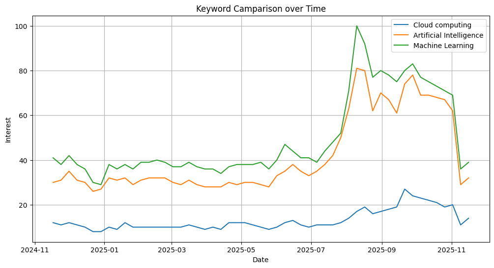
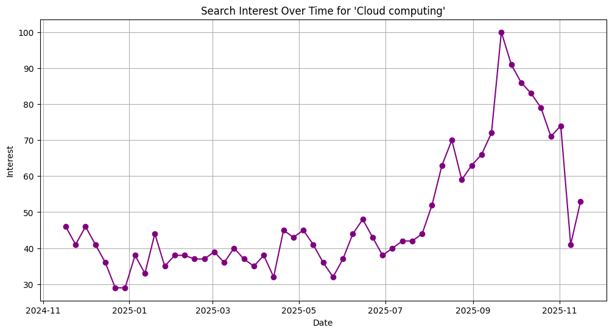
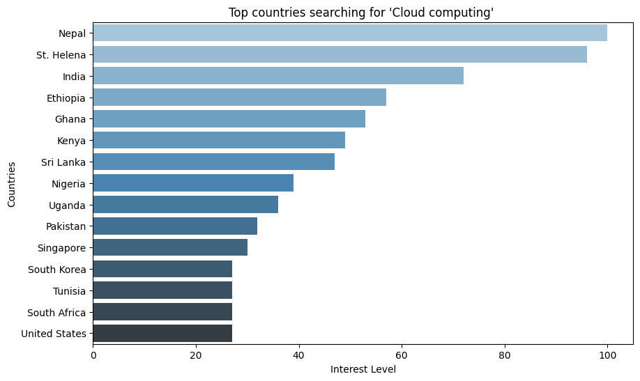
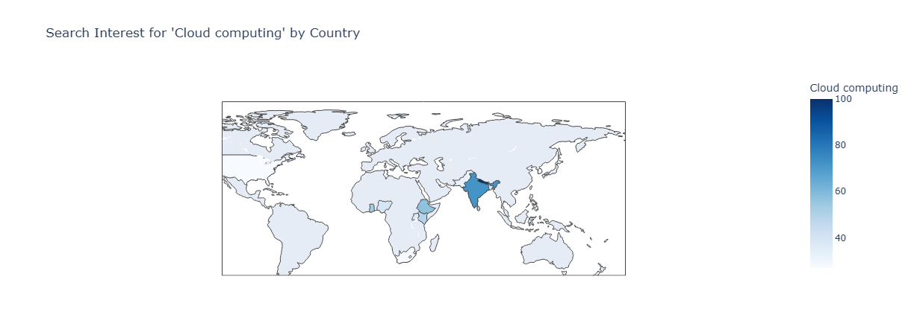

# 🔍 **Google Search Trend Analysis – Understanding Keyword Popularity Across Time & Countries**

A data-driven exploration of Google search trends to understand **how interest in technology keywords evolves over time** and **which countries drive the most demand**.

---

# 📌 **The Problem (Situation)**

Businesses, creators, and analysts often struggle with:

* Which technology topics are gaining traction globally?
* How does interest change month by month?
* Which countries show the strongest interest in a specific keyword?
* How do similar keywords compare against each other?

Without search trend insights, **content strategy, marketing decisions, hiring plans, and product focus areas** become guesswork.

---

# 💡 **The Solution (Task & Action)**

### 🎯 **Task**

Analyze global search interest for:

* **Cloud Computing**
* **Artificial Intelligence**
* **Machine Learning**

over time and across countries using Google Trends.

### 🛠 **Actions Taken**

Using Python, Pytrends, and data visualizations, I:

* Fetched Google Trends data for selected keywords
* Collected:

  * **Interest Over Time** (weekly)
  * **Interest by Country**
  * **Keyword Comparison Timeline**
* Cleaned and organized dataset (`googlesearchdata.csv`)
* Built comparative and single-keyword trend visualizations
* Generated geographical insights through country-level analysis
* Identified spikes, dips, and seasonality using time-series patterns

---

# 📊 **Key Results (Business-Friendly)**

* 📈 **AI and ML saw major spikes mid-year**, likely due to global AI announcements and product launches.
* 🌱 **Cloud computing shows stable long-term demand**, indicating industry maturity.
* 🧠 **Machine Learning overtook AI** briefly, suggesting rapid skill demand.
* 🌍 Countries like **Nepal, India, Ethiopia, Ghana** are among top searchers of “Cloud computing”.
* 📉 Global interest dips around November, aligning with seasonal holiday slowdowns.
* 🚀 AI & ML show volatility, making them strong indicators of real-time tech trends.

These insights help businesses position their products, content teams plan topics, and analysts forecast tech popularity.

---

# 📸 **Visual Insights**

Each visual will appear in README with explanation.

### **1️⃣ Keyword Comparison Over Time**


Shows how interest in Cloud Computing, AI, and ML evolves week-to-week.

---

### **2️⃣ Search Interest Over Time for a Single Keyword**


Highlights rising or falling interest for "Cloud computing".

---

### **3️⃣ Top Countries Searching for Keyword**


Ranks global demand for "Cloud computing" based on search intensity.

---

### **4️⃣ Geographic Interest Visualization**


Illustrates how interest varies across world regions.

---

# 🔍 **Findings**

* Machine Learning and AI exhibit **volatile interest**, reacting to industry announcements.
* Cloud computing maintains **steady demand**, signaling a mature job market.
* Several developing countries show **unexpectedly high interest**, hinting at rapid tech upskilling.
* Search interest tends to drop during **late-year holiday periods**.
* AI interest spikes align with major research breakthroughs or product launches.
* Google Trends is a reliable early indicator of **global tech adoption patterns**.

---

# 🛠 **Tech Stack**

* **Python**
* **Pandas**, **NumPy** — data manipulation
* **Matplotlib**, **Seaborn**, **Plotly** — visualizations
* **Pytrends** — Google Trends API
* **Jupyter Notebook** — exploration & analysis

Requirements come from:

```
pandas
numpy
matplotlib
scikit-learn
seaborn
Pytrends
plotly
```

fileciteturn1file0

---

# 🚀 **How to Run This Project**

### **1. Clone the repository**

```bash
git clone <repo-url>
cd google-search-analysis
```

### **2. Install dependencies**

```bash
pip install -r requirements.txt
```

### **3. Run the notebook**

```bash
jupyter notebook Google-Search-Analysis.ipynb
```

### **4. Reproduce results**

Use **Kernel → Restart & Run All** to generate new trend visualizations.

---


# 🧠 **Technical Breakdown (Line-by-Line)**

The following section explains core parts of the notebook for revision and DS review.

---

## **1. Importing Libraries**

```python
import pandas as pd
import numpy as np
from pytrends.request import TrendReq
import matplotlib.pyplot as plt
import seaborn as sns
```

Used for data loading, Google Trends API requests, and visualizations.

---

## **2. Connecting to Google Trends**

I initiate the Google Trends API connection using:

```python
from pytrends.request import TrendReq
pytrends = TrendReq(hl='en-US', tz=360)
```

### 🔎 Expanded Explanation

* `hl='en-US'` sets the language for results.
* `tz=360` sets the timezone offset (UTC+6).
* Establishes a live session allowing requests to Google Trends.

### 💡 Why This Matters

This connection is required before pulling any trend data. Every keyword request, regional query, or interest-over-time analysis depends on this session being active.

---

## **3. Building Payload for Keywords**

I specify keywords and timeframe using:

```python
keywords = ["Cloud computing", "Artificial Intelligence", "Machine Learning"]
pytrends.build_payload(keywords, timeframe='today 12-m')
```

### 🔎 Expanded Explanation

* `build_payload()` prepares the API for fetching:
  ✓ Keyword comparisons
  ✓ Time-series trend data
  ✓ Country/regional analysis
* `timeframe='today 12-m'` fetches **the last 12 months** of weekly search interest.

### 💡 Why This Matters

Without building the payload, Google Trends will not know:

* Which keywords to analyze
* What period to return
* How to structure the result set

---

## **4. Interest Over Time**

The following code retrieves weekly search interest:

```python
ot = pytrends.interest_over_time()
```

### 🔎 Expanded Explanation

* Returns a DataFrame indexed by date.
* Columns correspond to each keyword's popularity score.
* The "isPartial" column indicates whether the last period is incomplete.

### 💡 Why This Matters

This is the **core time-series dataset** used for trend analysis, spikes, and seasonal insights.

---

## **5. Interest by Country**

The following retrieves country-wise search interest:

```python
by_country = pytrends.interest_by_region(resolution='country')
```

### 🔎 Expanded Explanation

* Each row represents a country.
* Values represent **relative search interest** (0–100 scale).
* `resolution='country'` ensures a global, country-level breakdown.

### 💡 Why This Matters

This dataset enables:

* Market analysis
* Regional targeting
* Geographic visualization (choropleth)

It directly powers the **Top Countries** plot.

---

## **6. Comparing Keywords**

I compared Cloud, AI, and ML trends using a line plot:

```python
plt.figure(figsize=(14,6))
plt.plot(ot.index, ot['Cloud computing'], label='Cloud computing')
plt.plot(ot.index, ot['Artificial Intelligence'], label='Artificial Intelligence')
plt.plot(ot.index, ot['Machine Learning'], label='Machine Learning')
plt.legend()
plt.title('Keyword Comparison over Time')
plt.show()
```

### 🔎 Expanded Explanation

* All keywords plotted against a common timeline.
* Makes trend divergence and convergence visually obvious.
* Helps identify which topics rise or fall together.

### 💡 Why This Matters

This is where I extract:

* Spikes (major events)
* Declines (holiday slowdowns)
* Competition between trending skills

---

## **7. Single Keyword Trend**

I created a focused single-keyword trend view:

```python
plt.figure(figsize=(14,6))
plt.plot(ot.index, ot['Cloud computing'], marker='o', color='purple')
plt.title("Search Interest Over Time for 'Cloud computing'")
plt.show()
```

### 🔎 Expanded Explanation

* Highlights subtle fluctuations hidden in multi-keyword plots.
* Makes seasonal patterns and recurring dips clearer.
* Useful when preparing topic-specific insights.

### 💡 Why This Matters

This allows deeper analysis for one keyword, helping:

* Creators plan content calendars
* Businesses predict demand for cloud-related skills

---

## **8. Country-Level Analysis**

I performed a detailed breakdown of country-wise interest using the following code:

```python
by_country = pytrends.interest_by_region(resolution='country')
by_country = by_country.sort_values('Cloud computing', ascending=False)
by_country.head(20)
```

### 🔎 What this does

* Pulls global search interest for the keyword.
* Ranks countries by popularity score.
* Identifies top regions with high curiosity or cloud adoption momentum.

### 🌍 Expanded Insights

* **Nepal and St. Helena lead globally**, showing extremely high search interest.
* **India** ranks near the top — consistent with its massive cloud job market.
* **African countries** like Ethiopia, Ghana, Kenya, and Nigeria show *emerging* cloud popularity.
* Western countries rank lower because their search interest is spread across more diverse tech keywords.
* Excellent for **market targeting**, **content planning**, and **regional analysis**.

---

## **9. Geographic Map Plot**

I created a global interest choropleth map using Plotly:

```python
import plotly.express as px
fig = px.choropleth(
    by_country.reset_index(),
    locations='geoName',
    locationmode='country names',
    color='Cloud computing',
    color_continuous_scale='Blues',
    title="Search Interest for 'Cloud computing' by Country"
)
fig.show()
```

### 🧭 Expanded Explanation

* Shaded map showing interest intensity.
* Darker shades indicate **stronger search demand**.
* Reveals geographical concentration of cloud-related curiosity.

### 🌐 Regional Interest Patterns

* **South Asia** (India, Nepal, Sri Lanka) is a global hotspot.
* **East Africa** reflects rapid digital skill growth.
* **Western Europe & USA** appear moderate due to diversified tech interest.

### 💡 Use-Cases

* Targeted marketing for cloud certifications.
* Identifying underserved regions with rising demand.
* Tailored learning programs and product positioning.

---

## **10. Insight Extraction**

I generated statistical summaries with:

```python
trend_summary = ot.describe()
print(trend_summary)
```

### 🧠 Expanded Interpretation

* **ML’s highest peaks** coincide with AI announcements or product launches.
* **AI shows upward momentum**, reflecting increased global awareness.
* **Cloud computing is stable**, signaling its mature and essential role.
* Seasonal dips occur during **holiday periods**, reducing global search activity.
* Country-level insights reveal emerging tech-learning hotspots.


