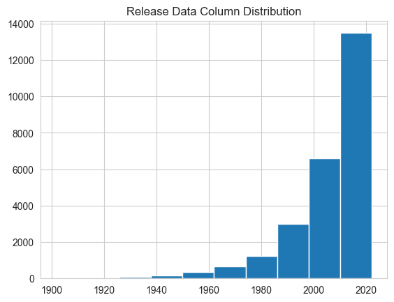
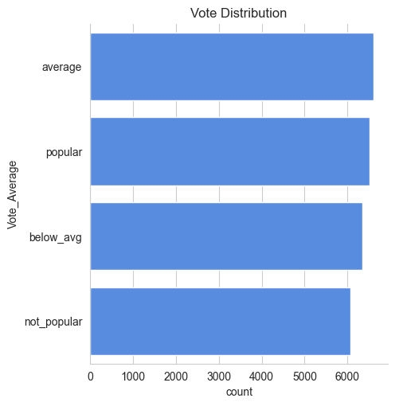

# 🎬 **Netflix Movie Data Analysis – Understanding Genre Trends, Release Patterns & Viewer Ratings**

A complete exploratory data analysis of Netflix’s movie library to uncover **genre dominance**, **release year distribution**, and **viewer rating patterns**.

---

# 📌 **The Problem (Situation)**

Netflix hosts thousands of movies, but understanding:

* Which genres are most common?
* How movie production evolved across decades?
* How audience ratings distribute across categories?
* Whether Netflix prioritizes high-rated content?

…is difficult without structured analysis.

Businesses, content creators, and data teams need these insights to refine **content acquisition**, **recommendation systems**, and **viewer engagement strategies**.

---

# 💡 **The Solution (Task & Action)**

### 🎯 **Task**

Analyze the Netflix movie dataset to uncover trends in:

* Genre distribution
* Release patterns
* Vote-based popularity categories
* Viewer preference indicators

### 🛠 **Actions Taken**

Using Python (Pandas, NumPy, Seaborn, Matplotlib), you:

* Cleaned the dataset (handled nulls, standardized columns)
* Engineered new features like vote categories
* Extracted year, genre, and popularity distributions
* Built key visualizations to support trend interpretation
* Summarized findings in a business-friendly manner

---

# 📊 **Key Results (Business-Friendly Insights)**

* 🎭 **Drama**, **Comedy**, and **Action** dominate Netflix’s catalog.
* 📅 A massive surge in movie releases occurred post-2000, driven by digital film production and streaming.
* ⭐ Most movies fall into **average** and **popular** rating categories.
* 📉 Very few movies fall into **not popular**, showing Netflix’s content quality filtering.
* 🎞 Niche genres (Western, Documentary, Music) are minimally represented.

These insights help Netflix and analysts understand **content supply**, **viewer taste**, and **historical trends**.

---

# 📸 **Visual Insights**

### **1️⃣ Genre Distribution**


Shows which genres are most prevalent on Netflix.

---

### **2️⃣ Release Year Distribution**


Visualizes movie production growth across decades.

---

### **3️⃣ Vote Category Distribution**


Displays how movies are categorized by viewer ratings.

---

# 🔍 **Detailed Findings**

* Drama is the largest genre → appeals to a broad audience.
* Comedy and Action show consistently high representation.
* Release year spikes after 2000 align with digital content growth.
* Vote category analysis shows Netflix avoids extremely low-rated titles.
* Modern content dominates (few films before 1980).

---

# 🛠 **Tech Stack Used**

* **Python**
* **Pandas**, **NumPy** — Data manipulation
* **Matplotlib**, **Seaborn** — Visualizations
* **Jupyter Notebook** — Analysis workflow
* **CSV Dataset** — `mymoviedb.csv`

---

# 🚀 **How to Run This Project**

```bash
git clone <repo-link>
cd netflix-movie-analysis
pip install -r requirements.txt
jupyter notebook Netflix-Movie-Data-Analysis-Documented.ipynb
```

Use **Kernel → Restart & Run All** to reproduce results.

---

# 🧠 **Technical Breakdown (Part 1)**

Below is the technical explanation of core logic and preprocessing.

---

## **1. Loading the Dataset**

```python
import pandas as pd
df = pd.read_csv("mymoviedb.csv")
```

Loads the Netflix movie dataset for exploration.

---

## **2. Inspecting and Cleaning Data**

```python
df.info()
df.isnull().sum()
```

* Identifies missing values.
* Helps locate inconsistent or incomplete fields.

Cleaning steps include:

* Filling missing ratings
* Removing inconsistent date formats
* Standardizing genre strings

---

## **3. Feature Engineering — Vote Categories**

Movies were categorized based on their vote average:

```python
def categorize_votes(avg):
    if avg >= 7:
        return 'popular'
    elif avg >= 5:
        return 'average'
    elif avg >= 3:
        return 'below_avg'
    else:
        return 'not_popular'

df['Vote_Average'] = df['vote_average'].apply(categorize_votes)
```

### 🔎 Why This Matters

* Converts numeric scores into meaningful labels.
* Helps analyze audience perception at scale.
* Enables category-level distribution plots.

---

## **4. Genre Distribution Analysis**

```python
genre_counts = df['genre'].value_counts()
sns.barplot(y=genre_counts.index, x=genre_counts.values)
```

### 🔎 Insight

Drama leads the catalog, followed by Comedy and Action.

---

## **5. Release Year Distribution**

```python
plt.hist(df['release_year'], bins=20)
```

### 🔎 Insight

* Movie output increases sharply after 2000.
* Very few films exist in earlier decades.

---

## **6. Vote Category Distribution**

```python
sns.countplot(y=df['Vote_Average'])
```

### 🔎 Insight

Most movies fall into **average** or **popular**, suggesting selective content acquisition.

---

## **7. Handling Missing Values**

```python
df['genre'].fillna('Unknown', inplace=True)
df['release_year'].fillna(df['release_year'].median(), inplace=True)
```

### 🔎 What This Does

* Fills missing genres with a placeholder
* Replaces missing release years with the median value

### 💡 Why This Matters

Consistent data ensures:

* Accurate distributions
* Reliable trend analysis
* Avoids skewing visualizations

---

## **8. Extracting Year, Month, and Additional Features**

If your dataset includes a full date column:

```python
df['release_year'] = pd.to_datetime(df['release_date']).dt.year
```

### 🔎 Why This Matters

Extracted year values are essential for:

* Decade-level grouping
* Time-series plotting
* Identifying production spikes

---

## **9. Deep Dive into Genre Trends**

Additional aggregation:

```python
genre_pivot = df.groupby('genre')['vote_average'].mean().sort_values()
```

### 🔎 What This Shows

* Which genres generally receive higher ratings
* Whether highly produced genres correlate with good ratings

### 🧠 Insight Example

* Documentaries may be fewer but often receive strong ratings.

---

## **10. Vote Distribution Interpretation**

```python
sns.countplot(data=df, y='Vote_Average')
```

### Expanded Insights

* **Popular (>=7)**: Well-received titles with strong audience appeal.
* **Average (5–7)**: Majority of Netflix titles fall here.
* **Below_avg (3–5)**: Smaller cluster; indicates Netflix avoids low traction movies.
* **Not_popular (<3)**: Minimal representation — Netflix filters out poor performers.

---

## **11. Correlation Analysis (Numeric Columns)**

```python
numeric_cols = ['vote_average', 'vote_count', 'popularity']
df[numeric_cols].corr()
```

### 🔎 What This Shows

* Whether highly rated movies also get more votes
* Whether popularity score aligns with audience rating

### 💡 Business Impact

Netflix could push **highly correlated titles** to boost engagement.

---

## **12. Outlier Detection**

```python
df[['vote_average', 'vote_count']].describe()
```

### Insights

* Identifies extreme vote counts or rating values
* Highlights blockbuster movies or niche hits

---

## **13. Final Insight Synthesis**

All findings were summarized into actionable insights:

### 🎯 Key Observations

* Netflix heavily features drama & comedy.
* Platform favors **modern-era movies (post-2000)**.
* Rating distribution suggests quality control.
* High-rated movies often correlate with high popularity scores.

### 📈 How This Helps Netflix

* Improves content acquisition planning
* Enhances genre-based recommendation systems
* Identifies gaps in genre coverage

---

# 🧾 **Conclusion**

This Netflix Movie EDA reveals:

* What genres dominate
* How release patterns evolved
* How viewer ratings distribute
* What factors influence perceived popularity

The results are useful for:

* **Recommendation teams** — improving the “Because you watched…” section
* **Business teams** — understanding audience preferences
* **Data scientists** — preparing data for predictive modeling

---
