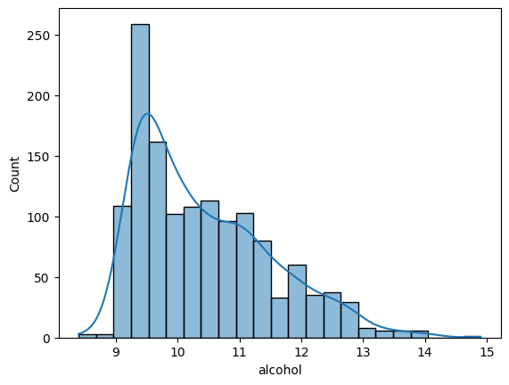
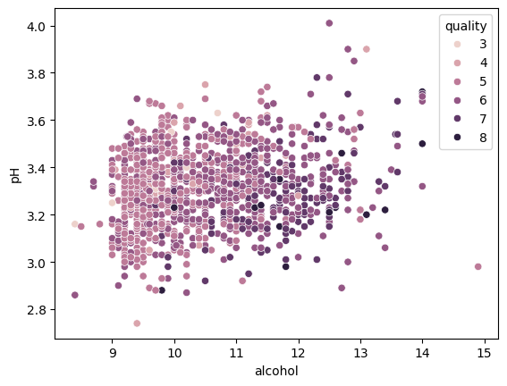
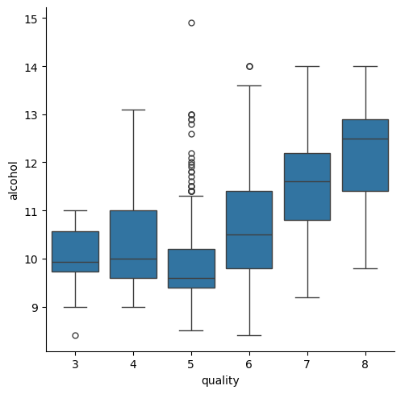
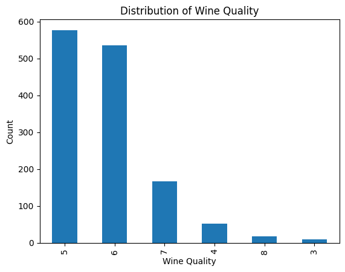
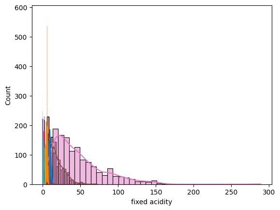
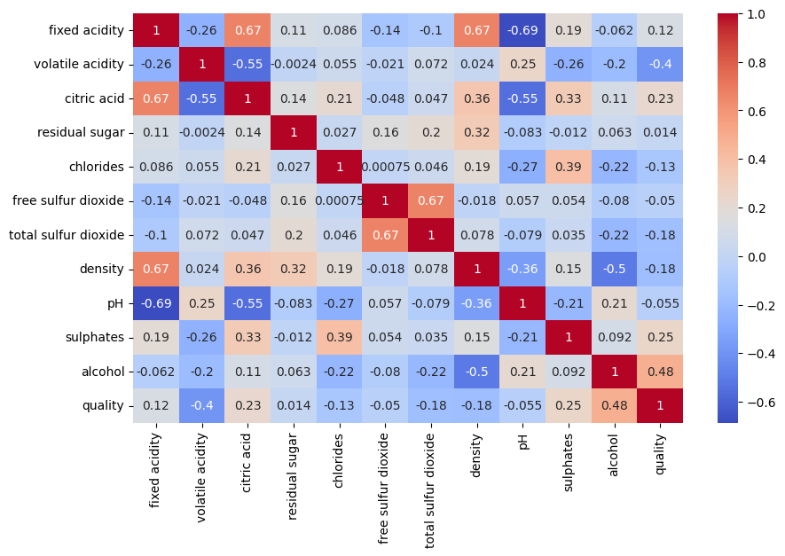
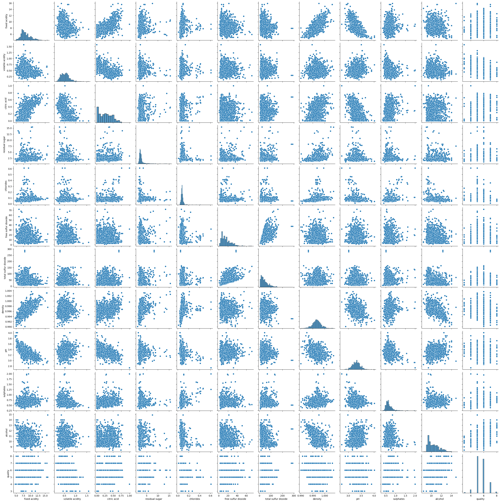

# 🍷 **Wine Quality Analysis – Understanding Chemical Properties & Their Impact on Wine Ratings**

A complete exploratory data analysis of the **Red Wine Quality** dataset to understand how chemical features such as acidity, sugar, pH, sulphates, and alcohol contribute to the perceived quality of wine.

---

# 📌 **The Problem (Situation)**

Wine taste evaluation is traditionally subjective, depending on experts' sensory judgment. However, wine producers and sellers need **data-backed evidence** to:

* Identify chemical properties that improve wine quality
* Predict consumer ratings more consistently
* Optimize fermentation and preservation processes

Without scientific analysis, improving wine quality becomes guesswork.

---

# 💡 **The Solution (Task & Action)**

### 🎯 **Task**

Perform exploratory data analysis (EDA) to uncover **patterns, correlations, and key drivers** behind wine quality scores.

### 🛠 **Actions Taken**

Using Python, Seaborn, and Matplotlib, you:

* Loaded and cleaned the wine dataset
* Explored distributions for each chemical attribute
* Visualized relationships using scatterplots, boxplots, and pairplots
* Generated a correlation heatmap to quantify variable relationships
* Extracted insights linking chemical composition to wine quality

---

# 📊 **Key Results (Business-Friendly Insights)**

* 🍷 **Higher alcohol levels strongly correlate with higher wine quality**
* 📉 **Volatile acidity (vinegar smell) reduces wine quality significantly**
* 🧂 **Sulphates help improve preservation and taste**, contributing positively to quality
* 🧪 **Lower pH wines (more acidic)** generally score better
* 📊 Most wines fall under **quality levels 5 and 6**, meaning average or slightly above average quality

These insights help wineries refine production and blending processes to achieve higher-quality products.

---

# 📸 **Visual Insights**

### **1️⃣ Alcohol Distribution**



---

### **2️⃣ Alcohol vs pH (Colored by Quality)**



---

### **3️⃣ Boxplot: Alcohol vs Quality**



---

### **4️⃣ Distribution of Wine Quality**



---

### **5️⃣ Fixed Acidity Distribution**



---

### **6️⃣ Correlation Heatmap**



---

### **7️⃣ Complete PairGrid (All Feature Interactions)**



---

# 🔍 **Detailed Findings**

* Alcohol content rises consistently with higher quality labels
* Wines with **high volatile acidity** almost always score lower
* Fixed acidity and citric acid have mild but meaningful relationships to wine characteristics
* Higher sulphate content often improves oxidation resistance, supporting better taste
* pH varies in a narrow range but slightly lower pH yields better results

---

# 🛠 **Tech Stack Used**

* Python
* Pandas, NumPy
* Matplotlib, Seaborn
* Jupyter Notebook
* Dataset: `winequality-red.csv`

---

# 🚀 **How to Run This Project**

```bash
git clone <repo-link>
cd wine-quality-analysis
pip install -r requirements.txt
jupyter notebook Wine-Equality-EDA.ipynb
```

Use **Kernel → Restart & Run All** to ensure reproducible results.

---

# 🧠 **Technical Breakdown**

Below is the first half of the expanded technical breakdown of your analysis.

---

## **1. Loading the Dataset**

```python
import pandas as pd
df = pd.read_csv("winequality-red.csv")
```

Loads the red wine dataset containing 11 chemical properties and a quality score.

---

## **2. Inspecting Dataset Structure**

```python
df.info()
df.describe()
```

* Identifies missing values
* Shows variable ranges and distributions
* Confirms correct data types for numerical analysis

---

## **3. Alcohol Distribution Analysis**

```python
sns.histplot(df['alcohol'], kde=True, bins=20)
```

### 🔎 Insight

Alcohol follows a right-skewed distribution — high-quality wines tend to appear in the higher range.

---

## **4. Relationship: Alcohol vs pH (Color: Quality)**

```python
sns.scatterplot(data=df, x='alcohol', y='pH', hue='quality')
```

### 🔎 Insight

Higher alcohol & slightly lower pH wines cluster in the higher-quality groups.

---

## **5. Alcohol vs Quality (Boxplot)**

```python
sns.boxplot(x='quality', y='alcohol', data=df)
```

### 🔎 Insight

Boxplot clearly shows alcohol increasing with quality.

---

## **6. Distribution of Wine Quality**

```python
sns.countplot(x='quality', data=df)
```

### 🔎 Insight

* Most wines are rated **5 or 6**.
* Very few wines achieve scores of **3, 4, 7, or 8**.
* Indicates a **central clustering**, meaning most wines are average quality.

---

## **7. Fixed Acidity Distribution**

```python
sns.histplot(df['fixed acidity'], kde=True, bins=30)
```

### 🔎 Insight

* Fixed acidity is heavily right-skewed.
* Majority of wines lie between **6–10 g/L**.
* Some extreme values (>50) indicate rare fermentation conditions.

---

## **8. Correlation Heatmap**

```python
plt.figure(figsize=(12,8))
sns.heatmap(df.corr(), annot=True, cmap='coolwarm')
```

### 🔎 Key Correlation Insights

* **Alcohol ↗ quality** (strong positive): High-quality wines have higher alcohol.
* **Volatile acidity ↘ quality** (strong negative): More acidic smell → lower quality.
* **Sulphates ↗ quality**: Good preservative effect.
* **Density ↘ alcohol**: Denser wines tend to have lower alcohol.
* **pH ↘ fixed acidity**: As acidity increases, pH decreases.

### 💡 Why This Matters

This matrix visually reveals which variables strongly influence wine ratings.

---

## **9. Pairwise Feature Analysis (PairGrid)**

```python
g = sns.pairplot(df, diag_kind='hist', corner=True)
```

### 🔎 Insight

* Provides a **comprehensive view** of every variable vs every other variable.
* Highlights:

  * Linear relationships
  * Outliers
  * Cluster patterns
  * Distribution shapes

PairGrid is crucial for spotting **multicollinearity**, guiding future ML model building.

---

## **10. Outlier Exploration**

```python
df.describe()
```

### Observations

* Some wines contain extremely high sulphates, fixed acidity, or residual sugar.
* Outliers may represent:

  * Rare fermentation styles
  * Measurement noise
  * Specialty wines

### Importance

* Outliers heavily affect linear models.
* Helps decide whether scaling or trimming is needed.

---

## **11. Interpreting Chemical Impact on Quality**

### **Strong Positive Impact**

* **Alcohol** → boosts perceived richness
* **Sulphates** → enhance preservation

### **Strong Negative Impact**

* **Volatile acidity** → vinegary smell
* **Density** → heavy wines may taste flat

### **Weak/Neutral Impact**

* Citric acid, residual sugar, chlorides — small but stabilizing roles.

---

## **12. Final Insight Synthesis (Technical + Business)**

### ✔ Technical Takeaways

* Quality is most predictable from **alcohol, volatile acidity, sulphates**.
* Heatmap and scatterplots reveal clear separation in quality classes.
* Dataset shows mild multicollinearity.

### ✔ Business Takeaways

* Wineries should increase sulphates & alcohol *slightly* for better scoring wines.
* Reducing volatile acidity directly improves consumer perception.
* Most wines are mid-range quality → opportunity to produce higher-quality products.

---

# 🎯 **Conclusion**

The Wine Quality EDA demonstrates that wine excellence is driven by the **balance of alcohol, acidity, density, sulphates, and pH**. Using data-driven insights, producers can optimize fermentation and blending processes to consistently achieve higher ratings.

This dataset is now ready for:

* Predictive modeling
* Quality optimization simulations
* Chemical composition recommendations


