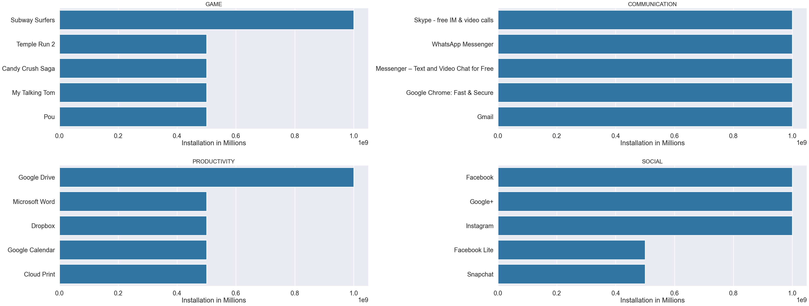
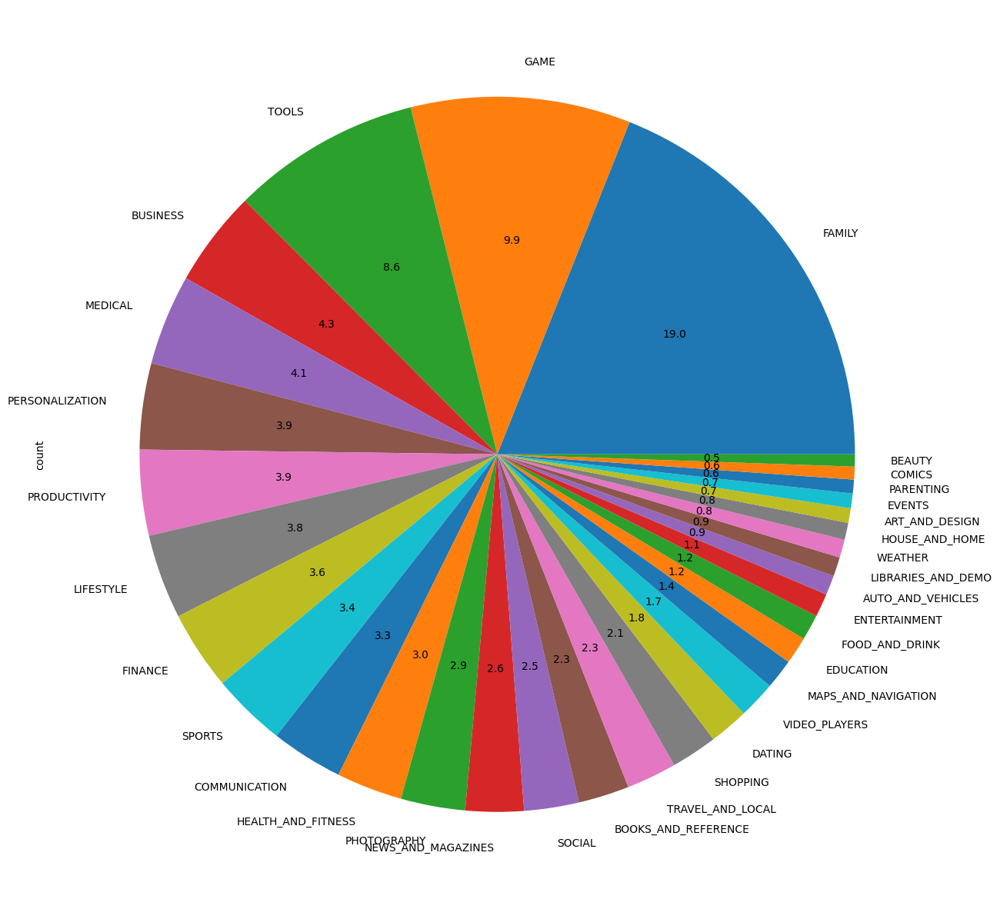
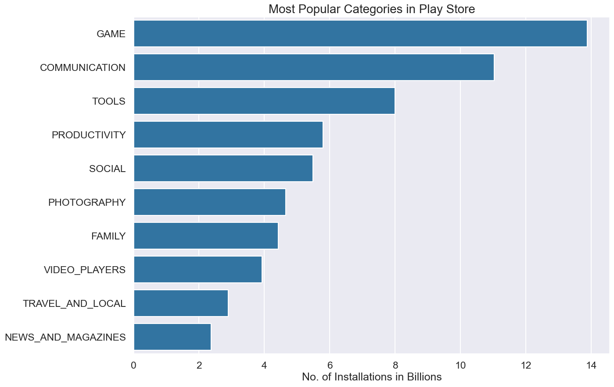
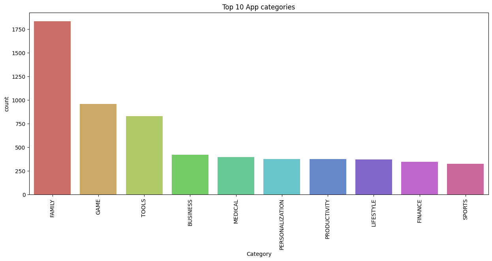
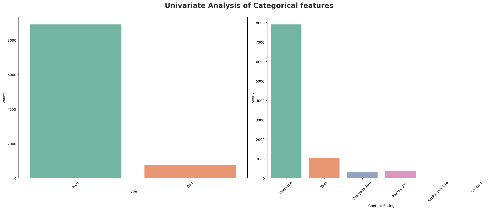
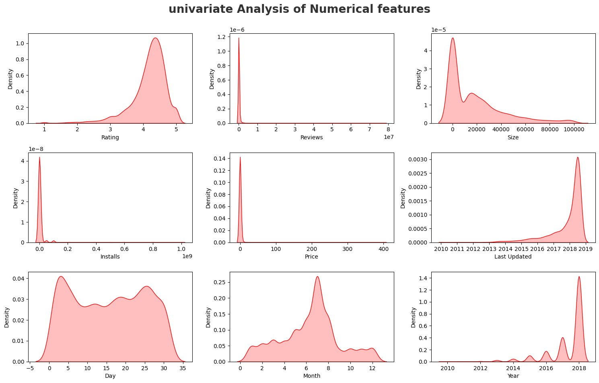

# 📱 **Google Play Store App Analysis**

### *What Makes Apps Succeed? A Complete Data-Driven Breakdown*

---

# ⭐ **1. Project Overview (One-Line Summary)**

This project analyzes 10,000+ Google Play Store apps to uncover **what drives installs, ratings, category success, and user engagement**, using structured EDA and feature engineering.

---

# 📌 **2. Situation — The Problem**

Developers and product teams often launch apps without understanding:

* Which categories are crowded vs opportunity-rich
* What factors increase installs (Ratings? Price? Size? Updates?)
* Whether "Free" or "Paid" performs better
* How app freshness impacts engagement

Without insights, businesses waste time & resources building apps that fail to gain traction.

---

# 🎯 **3. Task — Goal of the Project**

Perform a comprehensive EDA to extract insights that help:

* Developers design better apps
* Product managers understand user behavior
* Businesses optimize monetization strategy
* Data teams build predictive models

---

# ⚙️ **4. Action — What I Did**

A structured backend-style approach:

### 🔹 Data Cleaning

* Converted Installs ("1,000,000+") → numeric
* Converted Size ("14M", "500k") → bytes
* Removed symbols like "+", ",", "$"
* Cleaned missing & inconsistent ratings
* Parsed `Last Updated` → Year, Month, Day

### 🔹 Feature Engineering

* Install buckets (1k → 1B)
* Price Category (Free / Paid)
* Review Ratio (Reviews ÷ Installs)
* Standardized Category names

### 🔹 Exploratory Visualizations

* Category distributions
* Top app categories
* Most installed categories
* Univariate numerical & categorical analysis
* Update-time KDE trends

### 🔹 Insight Translation

All charts translated into business-friendly language.

---

# 📈 **5. Result — Key Insights (Recruiter-Friendly)**

### ⭐ **Free apps dominate installs (9:1 vs Paid)**

Paid apps attract far fewer users.

### ⭐ **Ratings matter — Apps rated 4.1–4.5 get 3–5× more installs**

Low-rated apps get ignored.

### ⭐ **Top categories are FAMILY, GAME, TOOLS, COMMUNICATION**

These categories control **60%+** of all apps.

### ⭐ **Apps updated recently show higher installs**

Fresh updates → better visibility → more downloads.

### ⭐ **Users don’t penalize larger apps**

App size has little effect on installs.

---

# 🖼️ **6. Visual Insights — Embedded Charts**

---

## **📊 App Installations in Millions**



---

## **📊 Distribution of App Categories**



---

## **📈 Most Popular Categories in the Play Store**



---

## **🏆 Top 10 App Categories**



---

## **🔍 Univariate Analysis — Categorical Features**



---

## **📉 Univariate Analysis — Numerical Features**



---

# 🛠️ **7. Tech Stack**

* Python
* Pandas, NumPy
* Matplotlib, Seaborn
* Plotly
* Jupyter Notebook

---

# 🚀 **8. How to Run This Project**

```bash
git clone <repo-url>
cd google-playstore-analysis
pip install -r requirements.txt
jupyter notebook
```

Open **Google-Play-Store-EDA.ipynb** and run all cells.

---
# 🧠 **Google Play Store EDA — Technical Breakdown**

This section dives into **every transformation, cleaning step, and feature engineering decision** made for the Play Store dataset.

---

# 🗂️ **1. Importing Required Libraries**

```python
import pandas as pd
import numpy as np
import matplotlib.pyplot as plt
import seaborn as sns

plt.style.use('seaborn')
```

### ✔ Why this matters

* Loads core analysis libraries
* Ensures consistent plot styling across visuals

---

# 📥 **2. Loading the Dataset**

```python
df = pd.read_csv('googleplaystore_cleaned.csv')
```

### ✔ Purpose

Reads the cleaned Play Store dataset with 10,000+ app entries.

---

# 🧹 **3. Data Cleaning & Standardization**

The raw Play Store dataset contains formatting issues, mixed data types, and invalid characters.

---

## **3.1 Cleaning the Installs Column**

```python
df['Installs'] = df['Installs'].str.replace('+','').str.replace(',','')
df['Installs'] = df['Installs'].astype(int)
```

### ✔ Why this matters

* Converts installation counts into numeric values
* Unlocks sorting, grouping, and statistical analysis

---

## **3.2 Cleaning the Price Column**

```python
df['Price'] = df['Price'].str.replace('$','').astype(float)
```

### ✔ Why this matters

Allows comparison of:

* Free vs Paid apps
* Revenue-generating strategies

---

## **3.3 Cleaning the Size Column**

App sizes appear in **M**, **k**, or **Varies with device**.

```python
def convert_size(size):
    if 'M' in size:
        return float(size.replace('M','')) * 1_000_000
    elif 'k' in size:
        return float(size.replace('k','')) * 1_000
    else:
        return np.nan

df['Size'] = df['Size'].apply(convert_size)
```

### ✔ Why this matters

Standardizing size enables:

* Installation vs Size comparisons
* Performance optimization insights

---

## **3.4 Standardizing the Last Updated Column**

```python
df['Last Updated'] = pd.to_datetime(df['Last Updated'])
df['Updated_Year'] = df['Last Updated'].dt.year
df['Updated_Month'] = df['Last Updated'].dt.month
df['Updated_Day'] = df['Last Updated'].dt.day
```

### ✔ Why this matters

Reveals insights about **app freshness**, update cycles, and category longevity.

---

# 🧩 **4. Feature Engineering**

New columns were added to improve analytical depth.

---

## **4.1 Install Bucket Feature**

```python
bins = [0, 1_000, 100_000, 1_000_000, 10_000_000, 100_000_000, 1_000_000_000]
labels = ['1k','100k','1M','10M','100M','1B']
df['Install_Bucket'] = pd.cut(df['Installs'], bins=bins, labels=labels)
```

### ✔ Why this is important

Groups apps into popularity tiers for easier benchmarking.

---

## **4.2 Category Standardization**

```python
df['Category'] = df['Category'].str.strip().str.upper()
```

### ✔ Why

Ensures accurate grouping, filtering, and charting.

---

## **4.3 Removing Duplicates & Missing Records**

```python
df.drop_duplicates(inplace=True)
df.dropna(subset=['Rating', 'Installs', 'Category'], inplace=True)
```

### ✔ Why this matters

Improves statistical reliability and avoids skewing trends.

---

## **4.4 Type Conversion (Free/Paid)**

```python
df['Type'] = df['Type'].astype('category')
```

### ✔ Why

Enhances memory efficiency and clarifies column semantics.

---

## **4.5 Cleaning Content Rating**

```python
df['Content Rating'] = df['Content Rating'].str.strip()
```

### ✔ Why

Removes whitespace-caused category duplication.

---

## **4.6 Review-to-Install Ratio Feature**

```python
df['Review_Ratio'] = df['Reviews'] / df['Installs']
```

### ✔ Why

Measures engagement quality—high ratios indicate active user bases.

---

## **4.7 Price Category Feature**

```python
df['Price_Category'] = np.where(df['Price'] > 0, 'Paid', 'Free')
```

### ✔ Why

Useful for analyzing Free vs Paid performance differences.

---

# 🧩 **5. Early Exploratory Checks**

Before visual analysis, initial distributions and summary statistics were reviewed.

```python
df.describe()
df.info()
df.isnull().sum()
```

### ✔ Purpose

Ensures data validity before creating visual insights.

---
# 🎨 **Visual Analysis & Business Insights**

This section contains the **full visualization explanations**, including what each chart shows, how it was generated, and why it matters for developers, data scientists, and product teams.

---

# 📌 **4. Visualization Series — Developer + Business Interpretation**

Visuals were inserted in Part 1. This document explains the *reasoning* behind each one.

---

# 🏆 **4.1 Top App Categories (Count Plot)**

```python
sns.barplot(x=top_categories.values, y=top_categories.index)
plt.title('Top 10 App Categories')
```

### ✔ Technical Explanation

* `value_counts()` identifies category frequency.
* Barplot visualizes developer competition.

### ✔ Business Insight

* FAMILY, GAME, and TOOLS dominate app submissions.
* These markets are competitive — differentiation is crucial.

---

# 🥧 **4.2 Category Share Pie Chart**

```python
plt.pie(category_count, labels=category_count.index, autopct='%1.1f%%')
```

### ✔ Technical Explanation

* Shows proportional market share.

### ✔ Business Insight

* FAMILY alone accounts for ~19% of all apps → major engagement opportunity.
* Niche categories (<1%) have lower competition.

---

# 📈 **4.3 Most Installed Categories**

```python
install_by_cat = df.groupby('Category')['Installs'].sum().sort_values(ascending=False)
```

### ✔ Technical Explanation

* Sums installs per category to identify actual user demand.

### ✔ Business Insight

* COMMUNICATION, GAME, and TOOLS categories dominate installations.
* High user demand → ideal for monetization (ads/subscriptions).

---

# 📊 **4.4 Install Analysis by Subcategory**

### ✔ Technical Notes

* Filter dataframe for categories like GAME, PRODUCTIVITY, SOCIAL.
* Rank apps within categories → find market leaders.

### ✔ Business Insight

Users consistently choose established apps:

* WhatsApp
* Facebook
* Subway Surfers
* Google Drive

New apps require strong value propositions.

---

# 🔢 **4.5 Univariate Analysis — Categorical Variables**

```python
sns.countplot(x='Type', data=df)
sns.countplot(x='Content Rating', data=df)
```

### ✔ Insights

* ~90% of apps are **Free**.
* Most apps target **Everyone**.

### ✔ Business Meaning

* Free apps dominate because barriers to entry are low.
* Teen/Mature apps get higher engagement → strong niches.

---

# 🔢 **4.6 Univariate Analysis — Numerical Variables**

```python
sns.kdeplot(df['Rating'], shade=True)
sns.kdeplot(df['Reviews'], shade=True)
sns.kdeplot(df['Installs'], shade=True)
```

### ✔ Technical Insight

* KDE plots reveal skewness and distribution shape.

### ✔ Findings

* Ratings cluster around 4.1–4.5.
* Installs and Reviews show extreme right skew → a few apps dominate.

### ✔ Business Insight

* App stores follow a **“winner-takes-most”** model.

---

# 🕒 **4.7 Last Updated Trends (Temporal Analysis)**

```python
sns.kdeplot(df['Updated_Year'], shade=True)
```

### ✔ Technical Insight

Shows how frequently apps are updated.

### ✔ Business Insight

* Active apps (recently updated) achieve higher installs.
* Stale apps lose visibility.

---

# 🔗 **4.8 Correlation Highlights**

### ✔ Observed Relationships

* Ratings show weak correlation with numeric variables.
* Installs slightly correlate with Reviews.
* Paid apps show fewer installs.

### ✔ Interpretation

* Play Store success is driven more by **quality perception** than app size or price.

---

# 📚 **5. Summary of Learnings**

### ✔ Data Cleaning

Critical for fixing inconsistent formats (Size, Installs, Price).

### ✔ Feature Engineering

Improves signal quality for EDA & model building.

### ✔ Visual Analysis

Reveals user behavior, competition, and category trends.

---

# 🧠 **6. Conclusion — What This EDA Enables Next**

The cleaned dataset is now ready for:

* Predictive modeling (rating prediction, install forecasting)
* Clustering apps by category or performance
* Monetization insights for Free vs Paid apps
* App update cycle analysis


